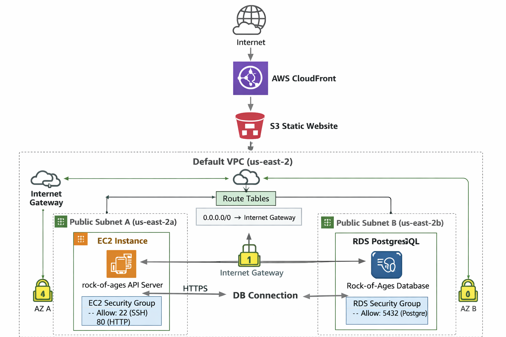

Lets walk through this networking diagram of our rock of ages setup. 

---

## 1. The Internet 🌍

This is where users are:
- Browsers
- Mobile phones
- Any device accessing your website or API

Everything starts here.

---

## 2. CloudFront (Global Edge Network)

**What it is:**  
CloudFront is a global content delivery network (CDN).

**What it does:**
- Sits *outside* your VPC
- Receives requests from users on the internet
- Caches and serves your frontend files (HTML, CSS, JS)
- Forwards requests to S3 if needed

**Key point:**  
CloudFront is **not inside your VPC**. It’s an AWS-managed global service.

**In your setup:**
User → CloudFront → S3 (static website)

---

## 3. S3 (Static Website Hosting)

**What it is:**  
An object storage service used here to host your frontend website.

**What it does:**
- Stores files like `index.html`
- Serves them publicly via HTTP
- Acts as the origin for CloudFront

**Networking model:**
- S3 does **not** live in your VPC
- It has its own AWS-managed networking

**Think of it like:**  
A public file server that AWS runs for you.

---

## 4. VPC (Virtual Private Cloud)

**What it is:**  
Your own private network inside AWS.

**Why it exists:**
- To isolate your backend infrastructure
- To control traffic with routing and security rules

**In your account you’re using:**
- The **default VPC**
- AWS already created it for you

---

## 5. Internet Gateway (IGW)

**What it is:**  
A door between your VPC and the public internet.

**What it does:**
- Allows resources in the VPC to:
  - Receive internet traffic
  - Send traffic back out

**Important rule:**
> Without an Internet Gateway, nothing in your VPC can talk to the internet.

---

## 6. Subnets (Smaller Networks Inside the VPC)

**What they are:**  
Subnets divide your VPC into smaller chunks.

**Default VPC behavior:**
- One subnet per Availability Zone
- Each subnet is public by default

**Public subnet means:**
- Has a route to the Internet Gateway
- Can host internet-facing resources

---

## 7. EC2 Instance (Your API Server)

**What it is:**  
A virtual machine running your Dockerized Django API.

**Why it needs a subnet:**
- EC2 must live in **one specific subnet**
- That subnet decides:
  - Which AZ it’s in
  - Whether it can reach the internet

**In your case:**
- EC2 is in a **public subnet**
- It has:
  - A public IP
  - A route to the Internet Gateway

**Traffic flow:**
Internet → IGW → Public Subnet → EC2

---

## 8. Security Group for EC2 (Firewall)

**What it is:**  
A virtual firewall attached to the EC2 instance.

**What it allows:**
- Port 22 (SSH)
- Port 80 (HTTP)

**Important concept:**
> Security groups are **stateful** — if traffic is allowed in, the response is allowed out automatically.

---

## 9. RDS (PostgreSQL Database)

**What it is:**  
A managed database service.

**Key difference from EC2:**
- RDS is **not a single server**
- AWS may:
  - Move it
  - Replace it
  - Fail it over

Because of this, we have less control over what subnet it is in. It can be moved to a different subnet at any given time by AWS or it can exist in multiple subnets at the same time depending on how the RDS was configured. It requires a subnet group configuration.

---

## 10. DB Subnet Group (Why RDS Uses This)

**What it is:**  
A list of subnets where RDS is allowed to run.

**Why it exists:**
- RDS needs **multiple subnets**
- They must be in different Availability Zones
- This enables high availability

**Mental model:**
> EC2 picks **one subnet**  
> RDS gets a **menu of allowed subnets**

---

## 11. Security Group for RDS

**What it does:**
- Allows PostgreSQL traffic on port 5432
- Controls *who* can connect to the database

**In your setup (for learning/demo):**
- Open to the internet (not recommended for production)

---

## 12. How Everything Connects (End-to-End)

### Frontend:
User → CloudFront → S3 (static website)

### Backend API:

User → Internet Gateway → Public Subnet → Security Group Rule → EC2 (Django API)

### Database:

EC2 → Security Group rule → RDS (PostgreSQL)

---

## 13. Big Picture Summary

- **CloudFront & S3**: Outside the VPC
- **VPC**: Your private network
- **Internet Gateway**: Connects VPC to the internet
- **Subnets**: Divide the VPC
- **EC2**: Lives in one subnet
- **RDS**: Lives in a subnet group
- **Security Groups**: Firewalls at the resource level

